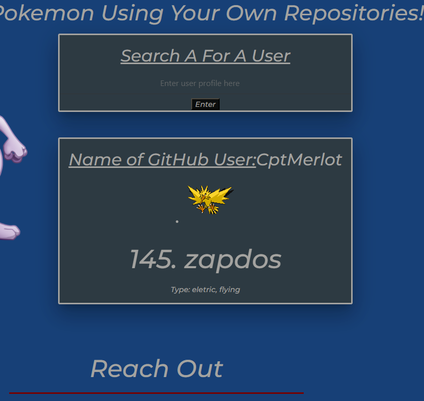

# Becoming Zapods

> This project was created in order to give ourselves a chance at becoming a zapdos for a github pages project that would look at users repositories and grade them based on their repo count, [Git Pokemon](https://mikeydgithub.github.io/Pokemon-App/), which was a very cool project.

## Usage

1. create_repos.py
    * This creates 75 repos to give us a chance at a lengadary pokemon like `zapdos`.
    * Make sure you update the tokens as wella s the repo count in order to create your github repos.
    * this will output a file with a list of all the github repos it created.
2. delete_repos.py
    * This will read from the output data and delete the repos from the output file.

